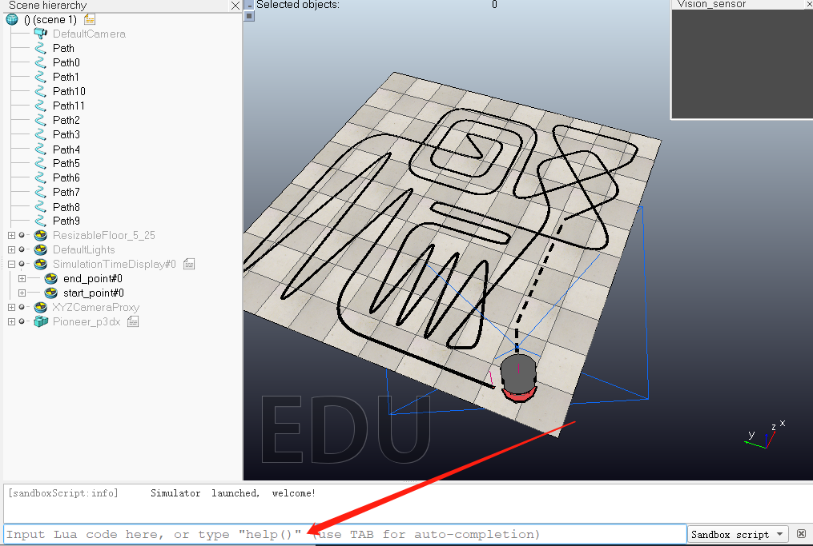

#### Usage

1. 在运行外部Python代码simulation.py前，请在VREP客户端的Lua控制台输入以下命令监听端口**（每次只能有一张地图在监听状态！）**

   ```
   repeat until simRemoteApi.start(19999,1300,false,true)~=-1
   ```

   

2. 所有地图的运行仿真时间dt均为**50ms**

3. Python运行环境必须为**3.6+**，依赖包括numpy、scipy和matplotlib，可利用以下命令安装依赖包

   ```
   pip install numpy scipy matplotlib
   ```

4. 运行算法命令如下，代码将自动载入VREP所需要的库文件等

   ```
   python simulation.py
   ```